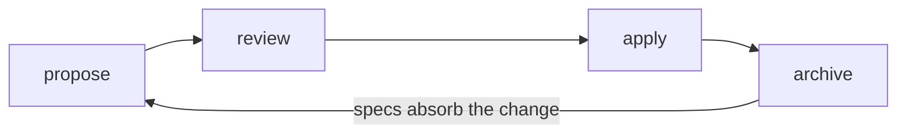
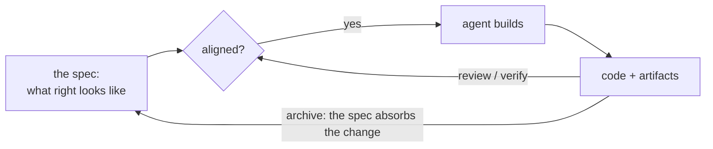
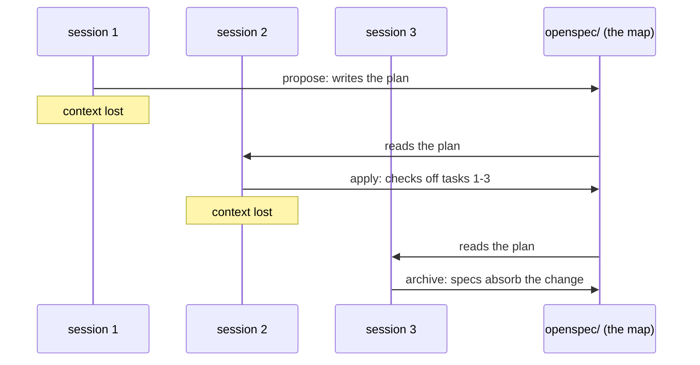

# Overview

> OpenSpec gives you and your coding agent a shared, reviewable plan before code is written.

<!-- Skeleton: headings only.
Narrative beats for the prose pass:
1. Shipping is an alignment problem with two distinct halves: build the RIGHT thing
   (direction) and build the thing RIGHT (execution). Already hard with humans;
   communication overhead grows with every person.
2. Agents amplify it: same problem, much faster and at greater scale. Things go wrong
   faster than you can notice, and every new context session starts from zero.
3. OpenSpec is NOT plan-everything-up-front. It is the shared map: you can update the
   destination and the route mid-journey, and everyone (humans and agents, across
   context sessions) keeps moving in the same direction.
4. Then show the loop, copy-only, and route onward. -->

## Building the right thing, and building it right

## Agents make it go wrong faster

## A shared map, not a plan up front

## The loop in 60 seconds

## Choose your path

## Diagram options under review

<!-- Temporary gallery so the four concepts are reviewable in the browser; cull to the
keepers when prose lands. Editable sources: docs-lab/diagrams/*.excalidraw. To update:
re-render the PNG, run pnpm sync:docs, refresh. -->

**A. Drift:** aligned at the start, small differences compound each session.

**B. Shared map:** private maps go stale; one shared map reroutes everyone.

**C. Control loop:** the open loop ships and hopes; the closed loop measures every cycle against the spec.

**D. Sessions:** chat context dies between sessions; the plan on disk survives.

**E. Native Mermaid, the loop:** the smallest possible statement of the cycle. Theme-aware, renders from text in this file.

**F. Native Mermaid, the closed loop (C, redrawn):** same argument as option C, drawn by Mermaid.

**G. Native Mermaid, sessions (D, redrawn):** same argument as option D, as a sequence diagram.

**H. Animated SVG (A, animated):** option A redrawn as a hand-authored SVG with CSS keyframes inside the file. The trajectories draw themselves and the loop repeats. No libraries, ships as a plain image, colors picked to read on light and dark.

