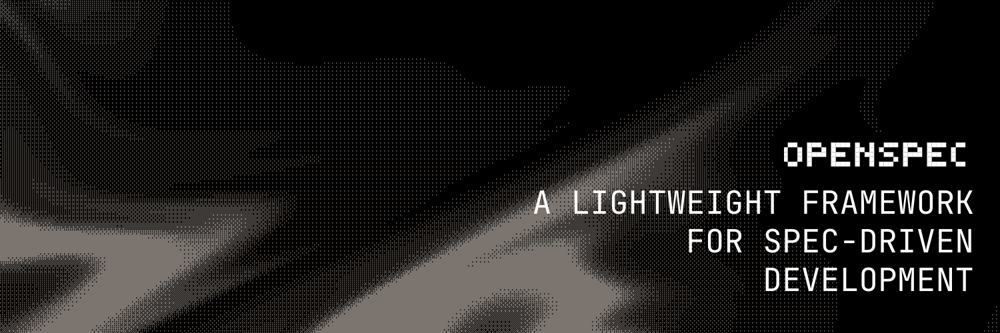

> **声明**：本文档由 AI 翻译，使用 `mimo-v2-pro` 进行翻译。

<p align="center">
  <a href="https://github.com/Fission-AI/OpenSpec">
    <picture>
      <source srcset="../../../assets/openspec_bg.png">
      
    </picture>
  </a>
</p>

<p align="center">
  <a href="https://github.com/Fission-AI/OpenSpec/actions/workflows/ci.yml"></a>
  <a href="https://www.npmjs.com/package/@fission-ai/openspec"></a>
  <a href="../../../LICENSE"></a>
  <a href="https://discord.gg/YctCnvvshC"></a>
</p>

<details>
<summary><strong>最受欢迎的规范框架。</strong></summary>

[](https://github.com/Fission-AI/OpenSpec/stargazers)
[](https://www.npmjs.com/package/@fission-ai/openspec)
[](https://github.com/Fission-AI/OpenSpec/graphs/contributors)

</details>
<p></p>
我们的理念：

```text
→ 灵活而非僵化
→ 迭代而非瀑布
→ 简洁而非复杂
→ 为存量项目而生，而非仅限新项目
→ 从个人项目到企业级均可扩展
```

> [!TIP]
> **新工作流已上线！** 我们用全新的工件引导工作流重构了 OpenSpec。
>
> 运行 `/opsx:propose "你的想法"` 即可开始。 → [了解更多](opsx.md)

<p align="center">
  关注 <a href="https://x.com/0xTab">@0xTab on X</a> 获取更新 · 加入 <a href="https://discord.gg/YctCnvvshC">OpenSpec Discord</a> 获取帮助和讨论。
</p>

### 团队

在团队中使用 OpenSpec？[发送邮件](mailto:teams@openspec.dev) 加入我们的 Slack 频道。

<!-- TODO: Add GIF demo of /opsx:propose → /opsx:archive workflow -->

## 实际演示

```text
你: /opsx:propose add-dark-mode
AI:  已创建 openspec/changes/add-dark-mode/
     ✓ proposal.md — 为什么要做这个变更，变更内容
     ✓ specs/       — 需求和场景
     ✓ design.md    — 技术方案
     ✓ tasks.md     — 实现清单
     准备好开始实现了！

你: /opsx:apply
AI:  正在实现任务...
     ✓ 1.1 添加主题上下文提供者
     ✓ 1.2 创建切换组件
     ✓ 2.1 添加 CSS 变量
     ✓ 2.2 接入 localStorage
     所有任务完成！

你: /opsx:archive
AI:  已归档至 openspec/changes/archive/2025-01-23-add-dark-mode/
     规范已更新。准备下一个功能。
```

<details>
<summary><strong>OpenSpec 仪表板</strong></summary>

<p align="center">
  
</p>

</details>

## 快速开始

**需要 Node.js 20.19.0 或更高版本。**

全局安装 OpenSpec：

```bash
npm install -g @fission-ai/openspec@latest
```

然后进入你的项目目录并初始化：

```bash
cd your-project
openspec init
```

现在告诉你的 AI：`/opsx:propose <你想构建的内容>`

如果你想要扩展工作流（`/opsx:new`、`/opsx:continue`、`/opsx:ff`、`/opsx:verify`、`/opsx:sync`、`/opsx:bulk-archive`、`/opsx:onboard`），使用 `openspec config profile` 选择并通过 `openspec update` 应用。

> [!NOTE]
> 不确定你的工具是否受支持？[查看完整列表](supported-tools.md) — 我们支持 20+ 种工具且持续增长。
>
> 同样适用于 pnpm、yarn、bun 和 nix。[查看安装选项](installation.md)。

## 文档

→ **[快速开始](getting-started.md)**：第一步<br>
→ **[工作流](workflows.md)**：组合和模式<br>
→ **[命令](commands.md)**：斜杠命令和技能<br>
→ **[CLI](cli.md)**：终端参考<br>
→ **[支持的工具](supported-tools.md)**：工具集成和安装路径<br>
→ **[概念](concepts.md)**：整体运作方式<br>
→ **[多语言](multi-language.md)**：多语言支持<br>
→ **[自定义](customization.md)**：打造你自己的工作流


## 为什么选择 OpenSpec？

AI 编程助手很强大，但当需求仅存在于聊天历史中时，它们就变得不可预测。OpenSpec 添加了一个轻量级的规范层，让你在编写任何代码之前就达成共识。

- **先达成共识再构建** — 人类和 AI 在代码编写前就规范达成一致
- **保持有序** — 每个变更都有自己的文件夹，包含 proposal、specs、design 和 tasks
- **灵活工作** — 随时更新任何工件，没有僵化的阶段门控
- **使用你的工具** — 通过斜杠命令支持 20+ 种 AI 助手

### 对比

**vs. [Spec Kit](https://github.com/github/spec-kit)**（GitHub）— 全面但笨重。僵化的阶段门控、大量 Markdown、Python 设置。OpenSpec 更轻量，允许自由迭代。

**vs. [Kiro](https://kiro.dev)**（AWS）— 强大但你被锁定在他们的 IDE 中，且仅限 Claude 模型。OpenSpec 与你已有的工具配合使用。

**vs. 不使用** — 没有规范的 AI 编程意味着模糊的提示和不可预测的结果。OpenSpec 在没有繁琐流程的情况下带来可预测性。

## 更新 OpenSpec

**升级包**

```bash
npm install -g @fission-ai/openspec@latest
```

**刷新 agent 指令**

在每个项目中运行此命令以重新生成 AI 指导，确保最新的斜杠命令处于激活状态：

```bash
openspec update
```

## 使用说明

**模型选择**：OpenSpec 与高推理能力的模型配合使用效果最佳。我们推荐 Opus 4.5 和 GPT 5.2 用于规划和实现。

**上下文管理**：OpenSpec 受益于干净的上下文窗口。在开始实现前清除上下文，并在整个会话中保持良好的上下文管理。

## 贡献

**小修复** — Bug 修复、拼写纠正和小改进可以直接提交 PR。

**大变更** — 对于新功能、重大重构或架构变更，请先提交 OpenSpec 变更提案，以便在实现开始前就意图和目标达成一致。

撰写提案时，请牢记 OpenSpec 的理念：我们服务于各种用户，涵盖不同的编码 agent、模型和用例。变更应该对所有人都适用。

**欢迎 AI 生成的代码** — 只要经过测试和验证。包含 AI 生成代码的 PR 应注明使用的编码 agent 和模型（例如 "Generated with Claude Code using claude-opus-4-5-20251101"）。

### 开发

- 安装依赖：`pnpm install`
- 构建：`pnpm run build`
- 测试：`pnpm test`
- 本地开发 CLI：`pnpm run dev` 或 `pnpm run dev:cli`
- 约定式提交（单行）：`type(scope): subject`

## 其他

<details>
<summary><strong>遥测</strong></summary>

OpenSpec 收集匿名使用统计。

我们仅收集命令名称和版本以了解使用模式。不收集参数、路径、内容或个人信息。在 CI 中自动禁用。

**退出：** `export OPENSPEC_TELEMETRY=0` 或 `export DO_NOT_TRACK=1`

</details>

<details>
<summary><strong>维护者和顾问</strong></summary>

请参阅 [MAINTAINERS.md](../../../MAINTAINERS.md) 了解核心维护者和顾问的列表，他们帮助指导项目发展。

</details>


## 许可证

MIT
