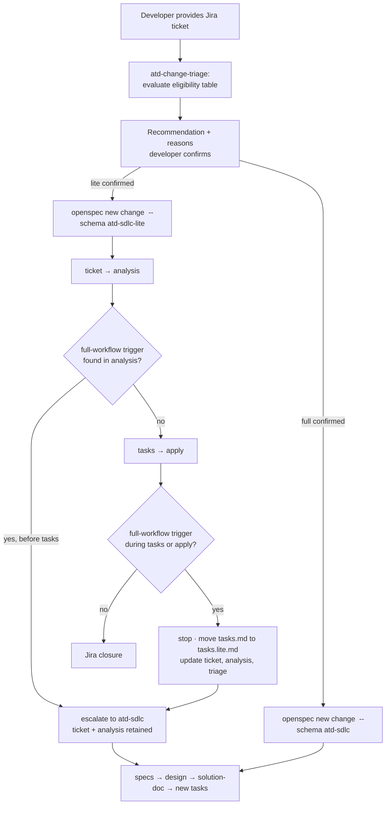

# Design: ATD SDLC Lite and Change Triage

## Context

`add-atd-sdlc-schema` establishes the full six-artifact pipeline. Pilot risk identified: disproportionate ceremony for small, low-risk corrections. OpenSpec schemas are static DAGs — a schema cannot conditionally skip artifacts — but the CLI already supports schema selection at change creation (`openspec new change <name> --schema <id>`), so a two-schema model with an entry-point triage step needs no core changes.

## Goals / Non-Goals

**Goals**

- A genuinely light path for low-risk corrections without losing traceability, standards checks, or Jira closure.
- Risk-based routing decided before change creation, with the developer confirming.
- Safe escalation whenever lite analysis or implementation uncovers wider impact.

**Non-Goals**

- Conditional artifacts inside one schema (requires core engine changes).
- Downgrading full changes to lite after planning begins.
- Deterministic CI enforcement of standards (separate follow-up change; triage and pilot metrics feed it).

## Decisions

### D1: Two schemas + entry triage, not one conditional schema

Routing happens at change creation via the existing `--schema` flag; an `atd-change-triage` skill evaluates the eligibility table and creates the change after developer confirmation. Confirmation is monotonic: a full recommendation cannot be weakened to lite; a lite recommendation can be strengthened. Triage rationale (recommendation, condition evaluations, confirmed choice) is written to a non-artifact `triage.md` sidecar in the change directory — never to `ticket.md`, because artifact completion is output-file existence and a partial `ticket.md` would mark the ticket artifact done, silently skipping Jira/Confluence intake, completeness checking, grilling, and write-back. The ticket instructions read `triage.md` and fold the record into the completed `ticket.md`; escalations append trigger, previous schema, new schema, and reason to `triage.md`. Alternative: triage fully generating the ticket artifact itself — rejected; it would make triage responsible for intake and grilling. Alternative: extending the artifact-graph engine with conditional nodes — rejected as a core change with upstream divergence for a problem routing already solves.

Honest impact note: shipping triage requires TypeScript source additions — workflow template exports, skill-generation registry AND command-generation registration (both delivery paths: `atd-change-triage` skill plus `/opsx:atd-triage` command, so command-only agent tools receive triage too), workflow profile/selection mappings, init/update synchronization, parity tests, and committed generated artifacts. These are additive registrations with no artifact-graph or CLI behavior changes, but this change is not schema-files-only.

Default installation: `atd-triage` is added to the fork's CORE_WORKFLOWS so `openspec init` installs it for every ATD developer without profile selection. Alternative: leaving it in ALL_WORKFLOWS (selectable only) with the bootstrap configuring a custom profile — rejected; org-wide entry-point tooling should not depend on per-machine profile setup.

### D2: Full-compatible lite artifacts, kept in sync by parity tests

Schemas cannot include or inherit instruction content from one another, so "shared" rules (AC IDs, SHA + file:line citations, code as source of truth, affected-stack set) are duplicated text in both schema files, guarded by a parity test that asserts the shared rule blocks match. Lite `ticket.md` and `analysis.md` satisfy the full schema's content contract — shorter content, same required data (notably affected stacks, which the standards mapping needs after escalation) — so escalation retains both artifacts without regeneration. Alternatives: independent lite instructions (escalation becomes lossy) or a build-time fragment generator (machinery ahead of need; revisit if a third schema appears) — both rejected.

### D3: One-way escalation by editing schema metadata and invalidating lite tasks

Before `tasks.md` exists, escalation updates the change's `.openspec.yaml` to `schema: atd-sdlc`. Schema metadata is reread on subsequent commands, so ticket and analysis remain done, specs and design become ready, solution-doc and tasks remain blocked.

If a full-workflow trigger appears after `tasks.md` exists or during apply, continuing under lite is unsafe. The agent stops implementation, leaves further lite boxes unchecked, moves `tasks.md` to `tasks.lite.md` as audit history (removing the tracked path), appends the trigger and schema transition to `triage.md`, updates `ticket.md` and `analysis.md` for the wider scope, and switches `.openspec.yaml` to `atd-sdlc`. With no `tasks.md`, full apply is blocked while specs/design become ready and solution-doc/tasks remain blocked. The new full task list must account for and verify or revert any partial implementation. Alternative: switching schemas while retaining `tasks.md` — rejected because filesystem completion would falsely mark the full tasks artifact complete and leave apply available. Alternative: recreating the change and copying artifacts — rejected; adds preservation risk for no benefit. Downgrade is unsupported.

### D4: Eligibility is a documented table the skill quotes, evaluated against code, not just ticket text

The decision table lives in `docs/atd/` and the triage skill evaluates each condition explicitly, quoting failed/uncertain conditions in its recommendation. Classification requires a bounded codebase preflight (owning component, entry points/call path, covering tests/specs, contract/data/security/dependency/integration/deployment impact) because localization, coverage, and impact conditions cannot be reliably determined from Jira text alone; anything unverifiable from ticket or code is uncertain and routes full. The preflight is deliberately lighter than `analysis.md` — just enough to classify safely. Implementation detail: the change is created with `--json` and `triage.md` is written under the returned change path, never an assumed repo-local `openspec/changes/`, since the CLI can resolve another planning root or store. This makes routing auditable and gives pilot metrics (selection rate, escalation rate) a stable denominator. Recurring deviation classes observed in pilots are candidates for promotion into deterministic CI checks (follow-up enforcement change).

## Solution Flow

## Risks / Trade-offs

- [Triage misclassifies a risky ticket as lite] → all-conditions-must-pass with uncertainty→full default; risk-based rules name the dangerous one-liner classes (authorization, SQL predicates, financial calculations); escalation catches what triage misses; escalation rate is a tracked pilot metric.
- [Lite becomes the default through developer pressure] → confirmation records the quoted conditions; selection and escalation rates surface abuse patterns for the enforcement follow-up.
- [Duplicated shared instruction text drifts between schemas] → parity test asserts the shared rule blocks match; drift fails CI.
- [A full-workflow trigger appears after lite tasks already exist] → the late-escalation procedure preserves the old checklist as `tasks.lite.md`, removes the tracked `tasks.md` path before switching schemas, refreshes ticket/analysis, and tests that full apply is blocked until a new full task list is generated.

## Rollout

Ships with or immediately after `add-atd-sdlc-schema`; pilot metrics extended with lite/full selection rate and lite→full escalation rate. Recurring standards deviations and missing-documentation findings from pilots feed the deterministic CI enforcement follow-up change.
