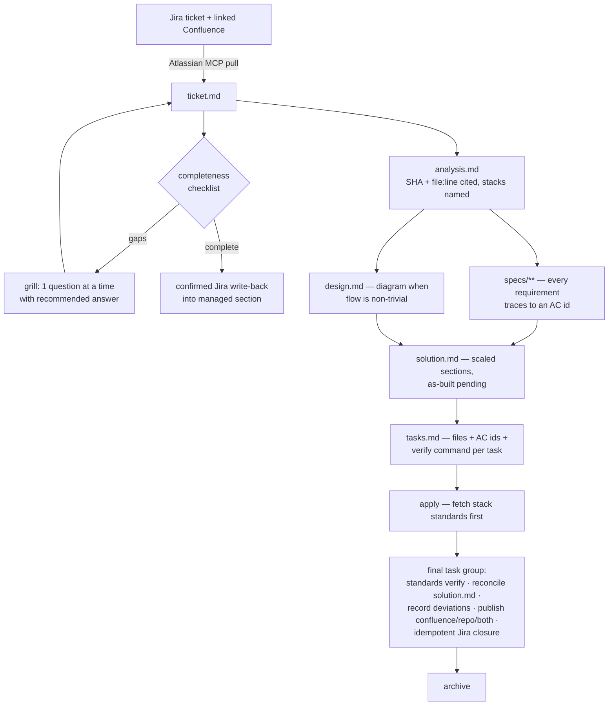

# Design: ATD SDLC Schema

## Context

This fork (`ATD-ONP/ATD-OpenSpec`) currently mirrors upstream `Fission-AI/OpenSpec` v1.6.0 with zero divergence. ATD teams work single-repo (one team per codebase) across Python, Spring Boot, Oracle EBS ERP, and Angular. Work starts from Jira tickets that are frequently incomplete; requirements sometimes live in linked Confluence pages. Developers use AI agents (Claude Code and others) with the Atlassian MCP already available.

Upstream's schema system resolves workflow definitions in three tiers (`src/core/artifact-graph/resolver.ts`): built-in `schemas/`, user-global data dir, project-local `openspec/schemas/`. Instructions assembly injects per-repo `context:`/`rules:` from `openspec/config.yaml` (`src/core/project-config.ts`) and an index of referenced stores' specs (`src/core/references.ts`).

An external design review (Codex, 2026-07-21) validated the extension-point approach and drove three revisions incorporated here: a pre-implementation `solution-doc` artifact with post-implementation reconciliation, confirmed idempotent Jira write-back, and splitting distribution concerns into follow-up changes.

## Goals / Non-Goals

**Goals**

- One workflow every ATD developer uses from Jira ticket to published documentation.
- Zero core-code changes — additive schema files only, keeping upstream syncs cheap.
- Coding standards centrally maintained, consulted at apply time, and verified as a task.
- Functional and technical documentation as a mandatory, auditable part of delivery — existing before code, reconciled after.
- Artifacts that are detailed but targeted: traceable to acceptance criteria, cited against code, no boilerplate.

**Non-Goals**

- Multi-repo/initiative changes (each repo has its own team; upstream's workspace work may cover this later).
- Building Jira/Confluence API calls into the CLI — the agent does integration via the Atlassian MCP.
- Executable CI enforcement of standards (agent review provides conformance evidence; CI enforcement is a future change).
- Telemetry default change and package identity — split into follow-up changes 3 and 4.

## Decisions

### D1: Workflow as a built-in schema, not core changes

The pipeline ships as `schemas/atd-sdlc/schema.yaml` + templates, riding the existing artifact-graph engine. Alternative considered: extending CLI commands with ticket/docs logic — rejected because it duplicates the Atlassian MCP, adds upstream divergence, and the instruction layer already reaches the agent.

### D2: Grilling protocol embedded verbatim in the ticket instruction

The interrogation protocol (checklist gate; explore codebase before asking; one question at a time with a recommended answer) is written directly into the schema instruction rather than referencing an external skill. Alternative: depend on a separately installed `grill-me` skill — rejected because schema instructions are the only distribution channel guaranteed present for every developer and agent tool.

### D3: Documentation as a pre-implementation artifact with reconciliation tasks

`solution.md` is generated after specs/design and before tasks (`tasks` requires `solution-doc` in the artifact graph — a real structural gate). Finalization is part of apply: the mandatory final task group reconciles the document against implemented code, records deviations with evidence, publishes to the configured destination, and posts an idempotent Jira closure comment. This replaces the earlier post-apply `docs` artifact whose gate could only live in instruction text; the graph structurally enforces docs-before-code, while docs-after-code is tracked — apply completion depends on the final group's checkboxes, though their content is generated through instructions. Alternative: post-apply docs artifact — rejected because apply is not a graph node, making its gate advisory.

### D4: Standards via referenced store, index-plus-fetch

Standards live in a standalone `atd-standards` OpenSpec repo referenced by every ATD repo, with the explicit mapping python → python-service-standards, spring-boot → spring-boot-standards, oracle-ebs → oracle-ebs-plsql-standards, angular → angular-standards. The reference index (summary + fetch recipe) keeps standards one tool call away without flooding context. Alternatives: baking standards into the fork package (requires a release per standards edit) or pasting them into each repo's config context (duplicated, drifts) — both rejected.

### D5: Scaled solution document, not fixed template

`solution.md` defines the full enterprise section set but instructions scale depth to change size and omit inapplicable sections. Alternative: mandatory full template per Codex review — rejected as boilerplate generation for small fixes, violating the anti-slop stance. The audit value is preserved: applicable sections are mandatory and reconciliation is always required.

### D6: Confirmed, idempotent external writes

All Jira/Confluence writes follow the same pattern: developer confirmation before the first write, and managed sections / updated-in-place comments so re-runs are idempotent. Alternative: silent default-on write-back — rejected after review; external writes to shared systems need explicit consent and must never clobber human content.

### D7: Delivery split into four changes

This change ships the schema and solution documentation only. Follow-ups: (2) Atlassian integration hardening — idempotency helpers and data governance; (3) telemetry opt-in default; (4) `@atd/openspec` package identity and internal release pipeline (changesets, pack checks, registry auth, workflow guards). Alternative: one combined change — rejected; the package rename alone touches the release path and deserves isolated review and rollback.

### D8: Analysis reads code as the source of truth, token-efficiently

At ATD the business logic lives in code, not documentation, so `analysis.md` derives current behavior from code and records doc/code conflicts in code's favor. The instruction carries a tool-agnostic reading strategy (entry-point location per AC, call-path tracing, targeted reads only) because schema instructions serve every agent tool; repo-specific accelerators (code-graph/index MCPs, EBS package tracing) are named per repo in `rules: analysis:`. Alternative: mandating a specific code-index tool in the schema — rejected because tool availability varies across agent environments and repos.

### D9: Standards store readiness is a hard pilot prerequisite

This repository defines how ATD projects reference and consume standards, but it does not own the external `atd-standards` repository or author its stack content. The separately owned `establish-atd-standards-store` prerequisite must be complete before pilot wave 1: the repository exists; all four mapped specs pass strict validation; stack leads and CODEOWNERS are assigned; registration/bootstrap instructions work; and a pilot machine passes `openspec store doctor atd-standards` and can fetch every mapped spec. Alternative: allowing the pilot to proceed on unresolved-reference warnings — rejected because standards consultation and conformance tasks would be untestable.

## Solution Flow

## Risks / Trade-offs

- [Instruction-level rules are advisory — an agent could skim the standards fetch or scaling rules] → the graph gate (tasks requires solution-doc) is structural and the final task group is tracked (apply completion depends on its checkboxes); per-repo `rules:` reinforce the rest; human review remains.
- [Atlassian MCP availability varies by agent tool] → ticket instruction includes a fallback: developer pastes ticket content, checklist still runs.
- [Upstream schema engine evolves (workspace/initiatives work in flight)] → fork diff is additive; re-sync before building on any in-flight upstream change.
- [Grilling can annoy developers on genuinely small tickets] → checklist passes trivially when the ticket is adequate; grilling only triggers on gaps.
- [Solution-doc scaling judgment varies across agents] → the instruction enumerates which sections are mandatory-when-applicable and the reconciliation task forces a second pass; pilot metrics (artifact rework, documentation completion) will show drift.
- [The schema ships before the external standards store is usable] → `establish-atd-standards-store` is a named rollout prerequisite with ownership and executable readiness checks; pilot wave 1 is blocked until it passes.

## Rollout

First complete `establish-atd-standards-store` and verify its repository, four strict-valid specs, ownership, registration path, store health, and mapped-spec fetches. Only then pilot progressively: one Python or Angular repo → Spring Boot → Oracle EBS → org-wide. Track clarification count per ticket, artifact rework, standards deviations, documentation completion, external-write failures, and cycle time.

## Resolved during review

- `rules:` keys accept artifact IDs only — `apply` is not an artifact and a `docs` key would target a nonexistent artifact (unknown-artifact warning, never injected). Consequences applied: documentation destination lives under `rules: tasks:` and lands in the generated publication tasks; the standards-fetch mandate lives in the schema's `apply.instruction`, the generated conformance tasks, and the referenced-store index already present in instructions.
