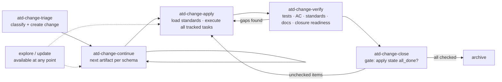

# Design: ATD Workflow Façades

## Context

`add-atd-sdlc-lite-triage` shipped `atd-change-triage` as the journey entry point, delivered through both generation paths and installed by default via the fork's CORE_WORKFLOWS. Everything downstream still speaks generic OpenSpec: `openspec-continue-change`, `openspec-apply-change`, `openspec-verify-change`, `openspec-archive-change`. Those workflows are schema-aware — they read the change's `.openspec.yaml` and follow whatever schema is selected — so the machinery already does the right thing for ATD changes. Two gaps remain: the names carry no ATD meaning (a developer who just ran `atd-change-triage` has no obvious next step), and the core profile (`propose, explore, apply, update, sync, archive, atd-triage`) omits `continue` and `verify` entirely, so the documented journey is not completable on a default install.

## Goals / Non-Goals

**Goals**

- One consistent, self-describing vocabulary for the ATD journey: triage → continue → apply → verify → close.
- Zero duplicated workflow logic — generic and ATD templates compose shared parameterized instruction-body builders.
- A core profile that installs exactly the workflows an ATD developer needs, by default.
- Generic workflows stay available for maintainers and non-ATD schemas.

**Non-Goals**

- Renaming or removing any generic workflow (upstream divergence for no benefit).
- New CLI commands, artifact-graph, or resolver behavior.
- Migrating the existing `atd-triage` id or `atd-change-triage` directory.
- Documenting the journey on the docs site (that is `add-atd-docs-site`'s scope; coordination only).

## Decisions

### D1: Single-source façades over existing workflows, not copied prompts

An agent skill cannot reliably invoke another skill, and the generic skills leave the core profile, so merely telling an ATD façade to "delegate" would not reuse anything. The generic continue/apply/verify/archive template modules therefore expose parameterized instruction-body builders. Their existing getters call those builders with the current generic names and policies, preserving generic generated content byte-for-byte. Each `atd-*` module composes the same builder with ATD journey names, ATD-only schema validation, and the step-specific policy hook (notably close's hard completion gate). Every module embeds `STORE_SELECTION_GUIDANCE` from `src/core/templates/workflows/store-selection.ts`. A parity test locks the generic output while façade contract tests cover the ATD additions. Alternative: rename the generic workflows — rejected; it breaks non-ATD users. Alternative: copy their instruction bodies — rejected; upstream fixes would drift. Alternative: reference an uninstalled generic skill from the façade — rejected; skills are not a dependable runtime call graph.

Every façade reads `schemaName` from `openspec status --json` before acting. It accepts only `atd-sdlc` or `atd-sdlc-lite`; any other schema stops with the matching generic workflow as the next step. This prevents ATD closure and standards policy from being implied on unrelated schemas.

### D2: Core profile = five façades + explore + update

CORE_WORKFLOWS becomes `['atd-triage', 'atd-continue', 'atd-apply', 'atd-verify', 'atd-close', 'explore', 'update']`. The five façades are the journey; `explore` and `update` stay because developers think through problems and revise planning artifacts mid-journey, and both are schema-neutral with no ATD-specific behavior to wrap. Generic `propose`, `sync`, `archive`, `continue`, `apply`, and `verify` leave core: propose authors a proposal directly, which the ATD schemas replace with ticket intake; sync/archive are folded into or gated by close; continue/apply/verify are replaced by their façades. Alternative: keep the generic ids in core alongside the façades — rejected; fourteen installed skills with six near-duplicates is worse UX than the problem being solved. Alternative: also wrap explore/update as `atd-*` façades — rejected; a façade that adds no ATD content is pure indirection (and more registry surface to maintain).

### D3: Close hard-gates all tracked tasks and preserves archive sync

Both ATD schemas already make closure mandatory inside apply, but only the full template names an `F. Final group`; lite uses a `Closure` group. `atd-close` therefore does not parse a heading. It obtains apply state from `openspec instructions apply --json` and requires `state: "all_done"`, which proves every tracked checkbox—including closure work—is complete. Any pending task is listed and sends the developer back to `atd-change-apply`; unlike generic archive, ATD close never offers an override for incomplete artifacts or tasks. It never performs publication or Jira closure itself.

Once complete, close retains the generic archive workflow's delta-spec assessment, optional sync, post-sync verification, and store-aware archive path behavior. Removing that phase would archive full-schema deltas without reconciling main specs. Alternative: put publication/Jira closure in close — rejected because closure would have two homes. Alternative: check only a named final heading — rejected because schema templates use different heading names and all tracked work, not only governance work, must be complete.

### D4: Generic workflows remain selectable; no id migrations

Nothing leaves ALL_WORKFLOWS. Maintainers working on this fork's own specs (schema `spec-driven`) and anyone using non-ATD schemas select the generic workflows through the custom profile (`getProfileWorkflows('custom', [...])`). The existing `atd-triage` id, `atd-change-triage` skill dir, and `/opsx:atd-triage` command are kept exactly as shipped — a rename to fit a hypothetical tidier scheme would force a WORKFLOW_TO_SKILL_DIR migration, drift-detection churn, and re-learning for pilot users, for zero functional gain. Only triage's hand-off wording changes (it names `atd-change-continue` as the next step).

### D5: Registry completeness is a spec requirement, with tool-detection named explicitly

Shipping `atd-triage` surfaced the full registry checklist the hard way: SKILL_NAMES/COMMAND_IDS in `src/core/shared/tool-detection.ts` were missed and caught in review. This change makes the checklist normative: workflow template module + `skill-templates.ts` export + both generation registries in `skill-generation.ts` + ALL_WORKFLOWS + CORE_WORKFLOWS + WORKFLOW_TO_SKILL_DIR + SKILL_NAMES + COMMAND_IDS + regenerated committed artifacts + tests. A registry-parity test asserts the four surfaces that enumerate workflows by id (generation registries, WORKFLOW_TO_SKILL_DIR, SKILL_NAMES/COMMAND_IDS) stay consistent with ALL_WORKFLOWS, so the next workflow cannot repeat the omission.

## Solution Flow

## Risks / Trade-offs

- [Façade instructions drift from the generic workflows they wrap] → generic and ATD getters compose shared parameterized instruction-body builders; a byte-for-byte generic-output parity test prevents accidental changes while façade tests cover ATD policy and hand-offs.
- [A registry surface is missed again (the tool-detection lesson)] → registry-parity test ties every enumerating surface to ALL_WORKFLOWS; spec requirement makes the checklist reviewable, not tribal knowledge.
- [Closure logic creeps into close over time] → the single-home rule is a SHALL requirement; tests assert pending apply tasks hard-block close and close never performs publication/Jira writes.
- [Close drops generic archive's spec synchronization] → close composes the shared archive body and tests a full-schema change with unsynced deltas before archive.
- [Existing installs have the old core set (generic apply/archive/propose/sync)] → `openspec update` synchronizes installed skills against the active profile using WORKFLOW_TO_SKILL_DIR drift detection; stale generic skills are reported/replaced by the standard update path, no bespoke migration.
- [Docs-site journey pages (in-flight `add-atd-docs-site`) ship with the old vocabulary] → coordination note in the proposal; the docs change is not yet implemented, so aligning its flow pages is a wording-level update before its apply, owned by that change.

## Rollout

Ships after `add-atd-sdlc-lite-triage` (façades wrap the journey it created). Regenerated `skills/` artifacts land in the same PR; init/update tests prove ignored project-local delivery flips vocabulary atomically. Coordinate `add-atd-docs-site` flow-page vocabulary before that change's apply. Pilot messaging: "start every ticket with `atd-change-triage`; each skill names the next one."
