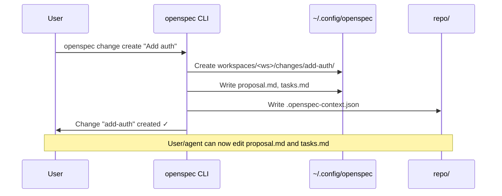
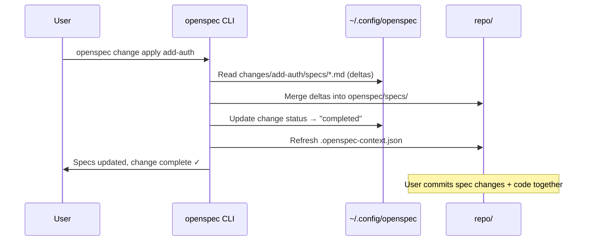

# RFC 0001: OpenSpec Workspaces and Off-Repo Change Storage

**Status:** Draft
**Authors/Reviewers:** TBC
**Last Updated:** 2024-XX-XX

> **See also:** [Appendix: Research & Decisions](./0001-openspec-workspaces-appendix.md) for background research, Q&A, and detailed decision rationale.

## Purpose

**Problem:** Users working on features that span multiple repos must currently duplicate change proposals in each repo, leading to drift and coordination overhead. Single-repo users also suffer from a convoluted archive step when applying changes.

**Solution:**
- Enable multi-repo planning by moving change proposals out of individual repos while keeping specs in-repo.
- Preserve agent usability with a lightweight, discoverable context projection per repo.
- Simplify the change lifecycle (apply changes directly, drop archiving) and keep the spec and code diff side-by-side.

## Goals (V1)

- Single source of truth for changes lives in a user-scoped workspace store (`~/.config/openspec`).
- Specs stay in the repo; only change proposals and workspace metadata move out-of-repo.
- Agents and humans can see "what change is active here?" via a small manifest in the repo root.
- Lay the groundwork for customizable workflows (hooks, reusable instructions) scoped to a workspace.
- Keep task tracking simple (Markdown checkboxes) while allowing future structured storage.
- Provide a clear migration path from in-repo `/openspec/changes`.

## Non-Goals (V1)

- Team/shared cloud sync (local-only for now).
- Automatic cross-repo PR orchestration or transactions.
- Rich task model or work log; basic checkboxes only.
- Replacing existing specs layout in-repo.
- CI/CD integration (workspace store lives in user home; CI pipelines that need change context should use environment overrides or check in workspace exports—deferred to future work).

## Before and After (Conceptual)

```
Before (today)
repo/
└─ openspec/
   ├─ specs/
   └─ changes/<change-id>/
       ├─ proposal.md
       ├─ tasks.md
       └─ specs/... (deltas)

After (V1)
repo/
├─ openspec/specs/              # unchanged spec source of truth
├─ .openspec-context.json       # git-ignored manifest (shadow)
└─ ...code...

~/.config/openspec/             # user-scoped workspace store
├─ index.json                   # repo/workspace index
└─ workspaces/<workspace-id>/
   ├─ workspace.json            # attached repos, defaults
   └─ changes/<change-id>/      # proposals, tasks, deltas
       ├─ proposal.md
       ├─ tasks.md
       └─ specs/... (deltas)
```

## Proposed Model (High-Level)

- **Workspace store**: XDG path `~/.config/openspec` holds `index.json` plus per-workspace folders.
- **Identifiers**:
  - `workspaceId`: user-provided slug or auto-generated UUID (e.g., `default`, `my-project`).
  - `changeId`: user-provided slug derived from change title or auto-generated (e.g., `add-user-auth`).
  - `repoId`: `{primary-remote-url}@{default-branch}` (normalized: SSH/HTTPS variants resolve to same ID). For repos without remotes, fallback to local path hash.
- **Context projection**: generate `./.openspec-context.json` in each attached repo (git-ignored) with:
  - `schemaVersion`, `generatedAt`, `repoId`, `workspaceId`, `branch`
  - `activeChangeId|null`, `changeTitle`, `status`
  - `specRoots`, `tasks` (checkbox state), `warnings`
  - `sourceHash`/`sourceVersion` for drift detection
- **Refresh policy**: regenerate manifest on `openspec status/context/set-active/attach`, or `openspec context --refresh`.
- **Drift detection**: `openspec verify` runs on `status/context`, warns (non-blocking) when:
  - Manifest `sourceHash` (hash of change proposal + tasks) differs from workspace store.
  - In-repo specs differ from expected state based on applied changes.
  - Branch in manifest doesn't match current git branch.
- **Tasks**: stay as Markdown checkboxes in change folders; structured format is future work.
- **Cross-repo specs**: defer to future dedicated "specs repo"; out-of-scope for V1.

## Workspace Customization & Hooks

Workspaces double as the unit of customization. Moving changes into `~/.config/openspec` gives us a neutral location to store **per-workspace workflow configuration** that can be projected into every attached repo alongside the manifest. Early capabilities include:

- **Lifecycle hooks**: Users can define shell commands or scripts (e.g., `./scripts/post-create.sh`) that OpenSpec runs after key events such as `change create`, `change apply`, `task toggle`, or `context --refresh`. Hooks let teams codify "what happens next?" right after a proposal is created—notify Slack, scaffold implementation branches, sync Linear tickets, etc.
- **Workflow presets**: Workspace metadata (`workspace.json`) can include reusable instructions/templates that describe the expected flow (e.g., "After proposal, run design review checklist", "Before apply, execute `openspec verify --strict`"). Agents surface these reminders in their startup instructions, and humans can read them from the manifest.
- **Composable steps**: Hooks are optional and orderable, so teams can compose bespoke workflows (e.g., `change.create` → run linting hooks, attach repo-specific instructions; `change.apply` → trigger spec sync + notify QA). V1 focuses on definition + discovery—the appendix tracks richer automation (custom task types, SDK integrations) for future versions.

This section keeps the RFC honest about a core benefit of workspaces: breaking the monolithic flow into smaller, customizable checkpoints without hard-coding them in every repo. Detailed research and long-term options live in the appendix’s "Future Considerations" and "Risk Analysis" tables.

## ASCII Flow (Agent View)

```
          +---------------------------+
          | ~/.config/openspec        |
          |  - index.json             |
          |  - workspaces/<ws>/...    |
          +-------------+-------------+
                        |
                        | openspec status/context --refresh
                        v
      +---------------------------+
      | repo/                     |
      |  - .openspec-context.json |  <- lightweight shadow manifest
      |  - openspec/specs/...     |  <- truth for specs
      |  - code                   |
      +---------------------------+
```

## Agent Workflow

How agents discover and use change context:

1. **Discover active change**: Agent reads `.openspec-context.json` in repo root (or calls `openspec status --json`).
   - Manifest provides: `activeChangeId`, `changeTitle`, `status`, `tasks` summary, `warnings`.
   - If manifest missing or stale, agent calls `openspec context --refresh`.

2. **Read full change details**: Agent calls `openspec change show <changeId> --json` to get:
   - Full proposal content (`proposal.md`)
   - Complete task list with checkbox states (`tasks.md`)
   - Spec deltas (what specs will change)
   - Paths to all change artifacts in workspace store

3. **Update task progress**: Agent calls `openspec task toggle <changeId> <taskIndex>` or edits `tasks.md` directly via workspace path (provided in step 2).

4. **Resume work**: On session start, agent reads manifest → identifies incomplete tasks → continues from last known state.

**Fallback for non-CLI agents**: If agent cannot invoke CLI, it reads the manifest for summary context and relies on user to sync task state manually.

## Workflows (Before → After)

- **Create change**
  - *Before*: `openspec change create` writes under `repo/openspec/changes`.
  - *After*: same command writes under `~/.config/openspec/workspaces/<ws>/changes/<id>`, then projects manifest into repo.

- **Resume work**
  - *Before*: read `/openspec/changes/<id>` directly in repo.
  - *After*: `openspec status` (or manifest) tells active change; agent reads tasks/proposal via CLI or manifest pointers.

- **Apply spec update**
  - *Before*: copy deltas into `/openspec/specs` and archive change.
  - *After*: applying a change updates in-repo specs directly; no archive step. Change record stays in workspace store.

## CLI Impact (V1)

- **New/updated commands** (shape, not syntax-final):
  - `openspec context [--refresh]` → writes `.openspec-context.json`.
  - `openspec attach <repo-path>` → register repo to workspace, emit manifest.
  - `openspec status [--json]` → shows active workspace/change, drift warnings.
  - `openspec verify` → compare change store vs. repo specs/tasks, warn on drift.
  - `openspec change show <changeId> [--json]` → output full change details (proposal, tasks, spec deltas, artifact paths).
  - `openspec change apply <changeId>` → applies spec deltas to in-repo specs, updates change status to `completed`, refreshes manifest.
  - `openspec task toggle <changeId> <taskIndex>` → toggle checkbox state in `tasks.md`, refresh manifest.
  - Existing `change create/validate` operate on workspace store paths.

## Data Examples

- **Manifest sketch (`./.openspec-context.json`):**
  ```json
  {
    "schemaVersion": "1",
    "generatedAt": "2024-XX-XXT12:00:00Z",
    "repoId": "git@github.com:org/api.git@main",
    "workspaceId": "my-project",
    "branch": "feature/add-auth",
    "activeChangeId": "add-user-auth",
    "changeTitle": "Add user authentication",
    "status": "in-progress",
    "specRoots": ["openspec/specs"],
    "tasks": [
      {"title": "Define auth spec", "done": true},
      {"title": "Implement JWT middleware", "done": false}
    ],
    "warnings": [],
    "sourceHash": "abc123",
    "relatedRepos": [
      {"repoId": "git@github.com:org/frontend.git@main", "role": "consumer"}
    ]
  }
  ```

  *Note: `relatedRepos` shows other repos in the same workspace affected by this change. Each repo gets its own manifest with the same `activeChangeId`.*

- **Workspace index (`~/.config/openspec/index.json`):**
  ```json
  {
    "workspaces": [
      {
        "id": "my-project",
        "repos": [
          {
            "repoId": "git@github.com:org/api.git@main",
            "paths": ["/Users/me/dev/api"]
          },
          {
            "repoId": "git@github.com:org/frontend.git@main",
            "paths": ["/Users/me/dev/frontend"]
          }
        ]
      }
    ]
  }
  ```

## Migration (Happy Path)

- Detect existing `/openspec/changes` and prompt to migrate into the workspace store.
- Copy change folders to `~/.config/openspec/workspaces/<ws>/changes/`.
- Write manifests into each repo (`.openspec-context.json`) pointing to migrated changes.
- Keep in-repo specs untouched; future changes update specs directly.
- Optionally keep legacy layout temporarily as read-only until confident.

## Risks / Tradeoffs

- **Loss of co-location**: agents need CLI/manifest indirection; mitigated by shadow manifest and simple commands (see Agent Workflow).
- **Portability**: local-only workspace; migration between machines requires exporting/importing the workspace folder.
- **CI/CD access**: out-of-scope for V1 (see Non-Goals); workaround is environment override or workspace export.
- **Drift**: specs live in-repo, changes live out-of-repo; mitigated by `openspec verify` and manifest hashes.
- **Back-compat**: legacy `/openspec/changes` requires migration; optionally support read-only compatibility during transition.

## Open Questions (Post-V1)

- Where to store branch→change mapping (manifest vs. workspace config) and how to handle branch renames?
- Minimal API/SDK needed for agent integrations vs. relying solely on CLI.
- Packaging/sync of workspace store for teams (git repo? cloud bucket?).
- How to represent cross-repo spec ownership without a dedicated specs repo?

## Acceptance Checklist (for reviewers)

- High-level model understandable via bullets + diagrams.
- Data shapes for manifest and index are clear enough for implementation.
- Migration story covers legacy users.
- Risks called out with basic mitigations.

---

## Appendix: User Flows

### A. Single-Repo Setup

```bash
cd ~/dev/my-project
openspec init                    # creates workspace, attaches current repo
# → ~/.config/openspec/index.json updated
# → .openspec-context.json written (git-ignored)
# → openspec/specs/ created if missing
```

That's it. User is ready to create changes.

---

### B. Multi-Repo Setup

```bash
# Create workspace and attach first repo
cd ~/dev/api
openspec init --workspace my-platform

# Attach additional repos to same workspace
cd ~/dev/frontend
openspec attach --workspace my-platform

cd ~/dev/shared-types
openspec attach --workspace my-platform
```

All three repos now share `my-platform` workspace. Changes created in any repo can reference specs across all attached repos.

---

### C. Creating a Change Proposal



---

### D. Applying a Change Proposal



---

### E. After the Work is Done

Once a change is applied:

| Location | State |
|----------|-------|
| `repo/openspec/specs/` | Updated with new/modified specs |
| `repo/.openspec-context.json` | `activeChangeId: null` or next change |
| `~/.config/openspec/.../changes/add-auth/` | Retained as historical record (status: `completed`) |

**Next steps for user:**
1. `git add . && git commit` — spec updates and code ship together
2. Create PR, merge
3. Start next change or detach repo from workspace when done
